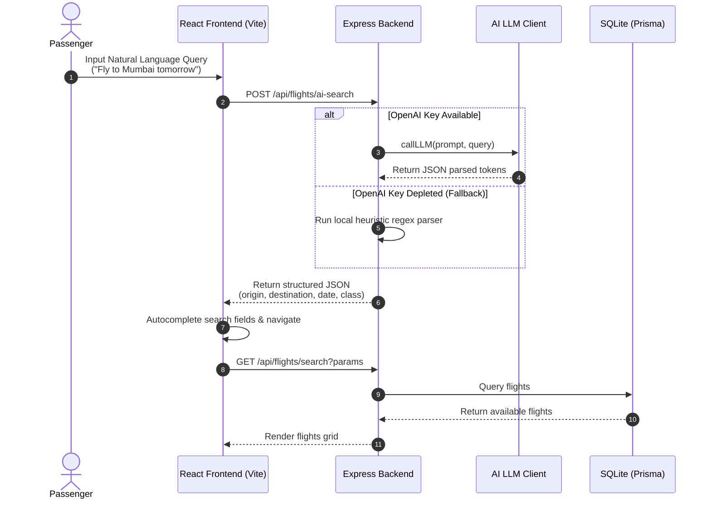

# FlyFast — Production-Grade AI Flight Booking Engine

FlyFast is a senior-developer portfolio application demonstrating an advanced, end-to-end flight booking platform. The project is designed with production-ready patterns, secure authentication models, resilient fallback architectures, and high-fidelity user experiences.

---

## System Architecture & Flow

FlyFast separates operations into a decoupled **React SPA frontend** (bundled via Vite) and an **Express.js backend** driven by **Prisma ORM** with **SQLite** for zero-setup database portability.



---

## Key Technical Highlights

### 1. Resilient AI Natural Language Super Search
- **Feature:** A Spotlight-style smart search box that interprets queries like *"Delhi to Mumbai tomorrow"* or *"Fly to Mysore next Monday"* and autocompletes coordinates immediately.
- **Fail-Safe Fallback:** Built-in catch handlers detect third-party service depletion (e.g., OpenAI `429 Insufficient Quota`). Upon failure, the system falls back to a **local regex-based heuristic parser**, ensuring the AI search is resilient and never returns errors to the user.

### 2. Interactive Seating Topology
- A visual, responsive seating grid representing the aircraft cabin map (Business Class vs Economy Class, Aisle splits, Window/Middle alignments).
- Dynamic pricing logic immediately factors selected seats (e.g. Business +₹5,000.00, Economy +₹800.00) and calculates booking checkout fees instantly.

### 3. Custom Experience Add-ons
- Seamlessly handles typical airline options: baggage limits (15kg, 25kg, 35kg), meals (Veg, Non-Veg, Vegan), Wi-Fi packages, and comprehensive travel insurance.
- Centralized price summary engine updates totals instantly and passes selection configurations during booking creation.

### 4. High-Fidelity E-Tickets & Boarding Passes
- Reservations are rendered as visual flight boarding passes (featuring flight details, custom CSS-drawn barcodes, passenger stubs, and dotted perforation separators).
- Fully printer-friendly CSS formats the passes cleanly when triggering `window.print()`.

### 5. Developer Sandbox (Dummy OTP Bypasses)
- To simplify automated QA testing and recruiter review, the OTP verification endpoints automatically accept `123456` or `000000` as valid verification codes in development.

---

## Tech Stack

- **Frontend:** React 18, Vite, TypeScript, TailwindCSS, Axios, React Router v6.
- **Backend:** Node.js (Express), Prisma ORM, JWT, bcrypt, express-rate-limit, helmet, compression.
- **Database:** SQLite (local dev portability) / easily switchable to PostgreSQL by updating the `provider` in `schema.prisma`.

---

## Quick Start Guide

### Prerequisites
- Node.js 18+

### Setup and Running

1. **Clone and Configure Env:**
   Create `backend/.env`:
   ```env
   DATABASE_URL="file:./dev.db"
   PORT=4000
   JWT_SECRET=USE_YOUR_OWN_STRING
   ```

2. **Initialize Database & Seed Data:**
   ```bash
   cd backend
   npm install
   npx prisma db push
   npx ts-node prisma/seed.ts
   ```

3. **Start the Backend Server:**
   ```bash
   npm run dev
   ```

4. **Start the Frontend Client:**
   ```bash
   cd ../frontend
   npm install
   npm run dev
   ```
   Open [http://localhost:3000](http://localhost:3000).

---

## 🛡 System Security & Production Checklist

- [x] **Strict CORS Controls:** Configured allowed origins dynamically via environment variable arrays to block unauthorized scripting.
- [x] **Helmet Security Headers:** Applied secure HTTP headers (XSS Filter, Content-Security-Policy limits) to restrict response injections.
- [x] **Rate Limiters:** Auth endpoints (`/api/auth`) and chatbot queries are rate-limited using `express-rate-limit` to prevent brute force.
- [x] **Graceful Shutdowns:** Listens for SIGINT/SIGTERM to cleanly close Prisma database clients and pending server connections.
- [x] **Global Error Boundaries:** Re-route unexpected runtime crashes inside Express or React to formatted error UI portals to protect database integrity.
